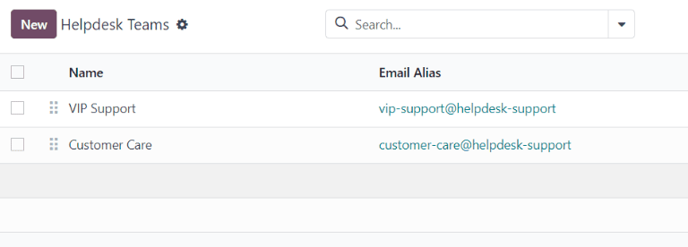
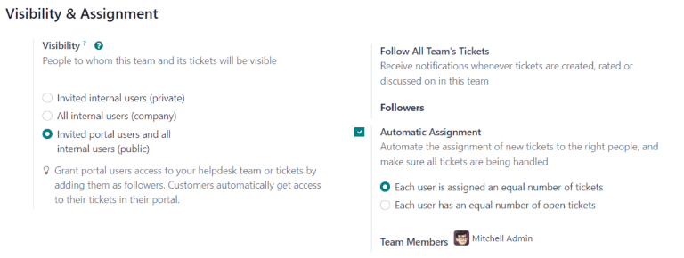
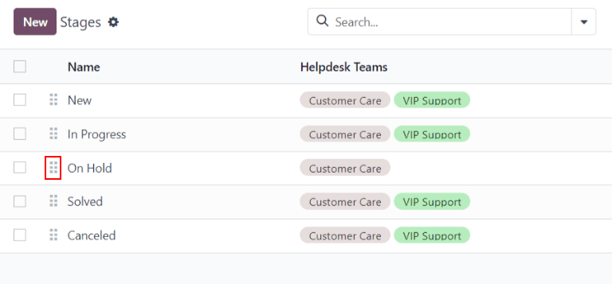
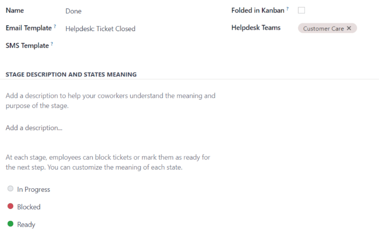
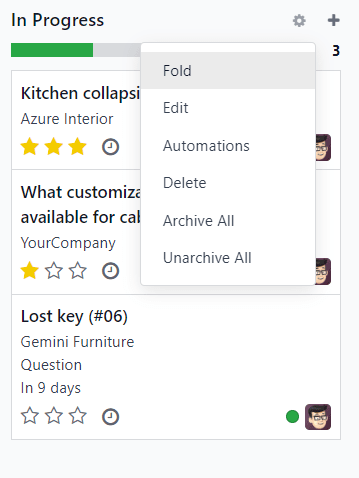

=============================
Getting started with Helpdesk
=============================

Odoo *Helpdesk* is a ticketing-based customer support application. Multiple teams can be configured
and managed in one dashboard, each with their own pipeline for customer submitted tickets. Pipelines
are organized in customizable stages that enable teams to track, prioritize, and solve customer
issues quickly and efficiently.

Create a Helpdesk team
======================

To view or modify *Helpdesk* teams, go to :menuselection:`Helpdesk app --> Configuration -->
Helpdesk Teams`. To create a new team, click on the :guilabel:`New` button in the top-left of the
dashboard.

Enter a :guilabel:`Name` for the new team. Enter a description of the team to the field below the
team name, if desired.

Visibility & Assignment
-----------------------

*Visibility* refers to what internal users and portal users will have access to this team and its
tickets. *Assignment* refers to how users will be assigned to handle each ticket.

Determine to whom the team will be visible
~~~~~~~~~~~~~~~~~~~~~~~~~~~~~~~~~~~~~~~~~~

Under the :guilabel:`Visibility` section, determine who can view this team and its tickets.

- :guilabel:`Invited internal users` have access to the team and tickets they are following. This
  can be modified on each individual ticket.
- :guilabel:`All internal users` have access to the team and all of its tickets without being a
  follower.
- :guilabel:`Invited portal users and all internal users` have access to the team without being a
  follower. Portal users will only be able to access tickets that they are following.

.. example::
   A `Customer Support` team intended to handle general issues with shipping and product issues
   would have the visibility setting :guilabel:`Invited portal users and all internal users`.
   However, a `Financial Services` team handling tickets related to accounting or tax information
   would only need to be visible to :guilabel:`Invited internal users`.

Follow all team's tickets
~~~~~~~~~~~~~~~~~~~~~~~~~

If a user should be notified about any updates regarding tickets for this team, select their name
from the :guilabel:`Followers` drop-down. Multiple users can be selected to follow a single team.

Automatically assign new tickets
~~~~~~~~~~~~~~~~~~~~~~~~~~~~~~~~

When tickets are received, they need to be assigned to a member of the team. This can be done
manually on each ticket individually, or through :guilabel:`Automatic Assignment`. Check the
:guilabel:`Automatic Assignment` checkbox to enable this feature for the team.

         in Odoo Helpdesk

Select one of the following assignment methods, based on how workload should be allocated across
the team:

- :guilabel:`Each user is assigned an equal number of tickets` assigns tickets to team members based
   on total ticket count, regardless of the number of open or closed tickets they are currently
   assigned.
- :guilabel:`Each user has an equal number of open tickets` assigns tickets to team members based on
   how many open tickets they are currently assigned.

.. tip::
   If a team has high-performers who tend to close tickets quickly, selecting :guilabel:`Each user
   has an equal number of open tickets` as the assignment method will ensure they have a heavier
   workload.

Finally, add the :guilabel:`Team Members` who will be assigned tickets for this team. Leave the
field empty to include all employees who have the proper assignments and access rights configured in
their user account settings.

.. important::
   If an employee has time off scheduled in the *Time Off* application, they will not be assigned
   tickets during that time. If no employees are available, the system will look ahead until there
   is a match.

.. seealso::
   - :ref:`Manage users <users/add-individual>`
   - :doc:`Access rights </applications/general/users/access_rights>`

Create or modify stages
=======================

*Stages* are used to organize the *Helpdesk* pipeline and track the progress of tickets. Stages are
customizable, and can be renamed to fit the needs of each team.

To view or modify *Helpdesk* stages, go to :menuselection:`Helpdesk app --> Configuration -->
Stages`.

.. important::
   :ref:`Developer mode <developer-mode>` must be activated in order to access the stages menu. To
   activate developer mode go to :menuselection:`Settings --> General Settings --> Developer Tools`
   and click on :guilabel:`Activate the developer mode`.

The list view displays the stages currently available in *Helpdesk*. They are listed in the order
they appear in the pipeline. To change the order of the stages, click and drag the buttons to the
left of the stage name.

.. tip::
   Change the stage order on the kanban view by dragging and dropping individual columns.

To create a new stage, click on the :guilabel:`New` button in the top-left of the stage list. Next,
choose a name for the new stage, and add a description, if desired. Fill out the remaining fields
following the steps below.

Add email and SMS templates to stages
-------------------------------------

When an email template is added to a stage, an email is automatically sent to the the customer when
a ticket reaches that specific stage in the helpdesk pipeline. Likewise, adding an SMS template will
trigger an SMS text message to send to the customer.

.. important::
   SMS Text Messaging is an In-App Purchase (IAP) service that requires prepaid credits to work.
   Refer to `SMS Pricing FAQ <https://iap-services.odoo.com/iap/sms/pricing>`_ for additional
   information.

To select an existing email template, select it from the :guilabel:`Email Template` field. Click on
the arrow key to the right of the field to edit the template.

To create a new template, click the field and enter title for the new template. Then select
:guilabel:`Create and edit`, and complete the form details.

Follow the same steps to select, edit, or create an :guilabel:`SMS Template`.

.. image:: getting_started/sms-template.png
   :align: center
   :alt: View of an SMS template setup page in Odoo Helpdesk

.. seealso::
   :doc:`/applications/general/email_communication/email_template`

Assign stages to a team
-----------------------

Make a selection in the :guilabel:`Teams` field on the :guilabel:`Stages` form. More than one team
may be selected, since the same stage can be assigned to multiple teams.

Fold a stage
------------

By default, stages are unfolded in kanban view. Tickets in an unfolded stage are visible in the
pipeline under the stage name, and are considered *open*. However, stages can be configured to be
folded in kanban. Folded stages are still visible in kanban, though the tickets in the stage are no
longer immediately visible.

.. warning::
   Tickets that reach a *folded* stage are considered closed. Closing a ticket before the work is
   completed can result in reporting and communication issues. This setting should only be enabled
   for stages that are considered *closing* stages.

To fold a stage, check the :guilabel:`Folded in Kanban` box on the :guilabel:`Stages` form.

Stages can be temporarily folded in the kanban view, by clicking on the settings icon and selecting
:guilabel:`Fold`.

.. important::
   Manually folding a stage from the kanban view is temporary and will **not** close the tickets in
   the stage.
